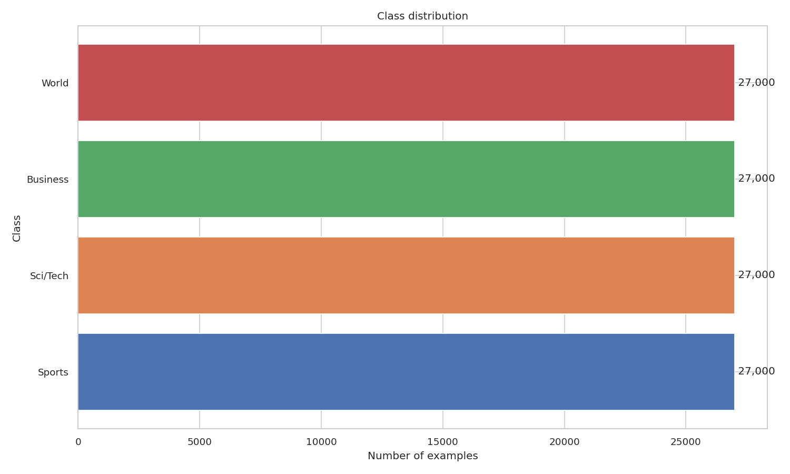
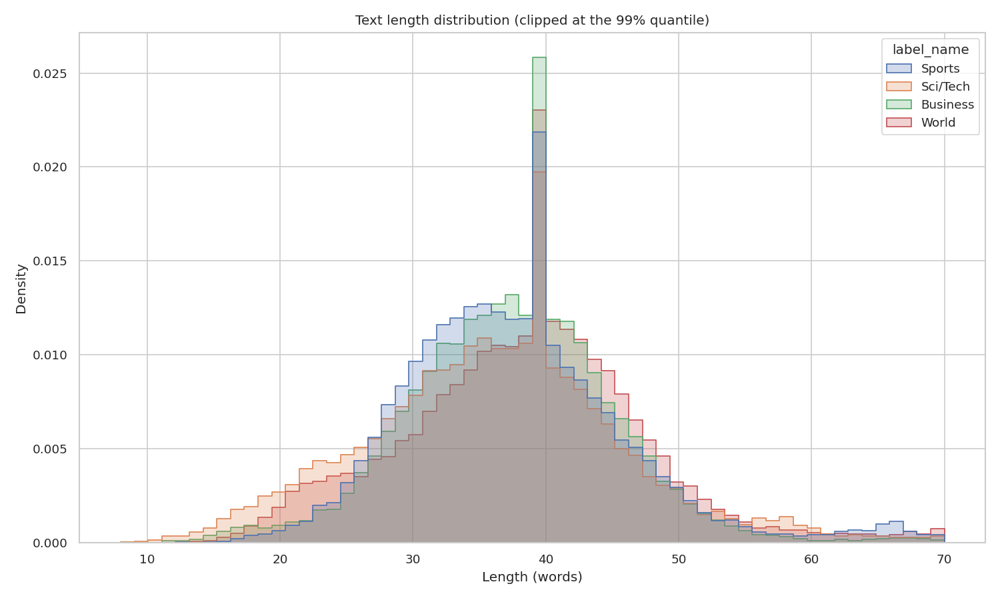
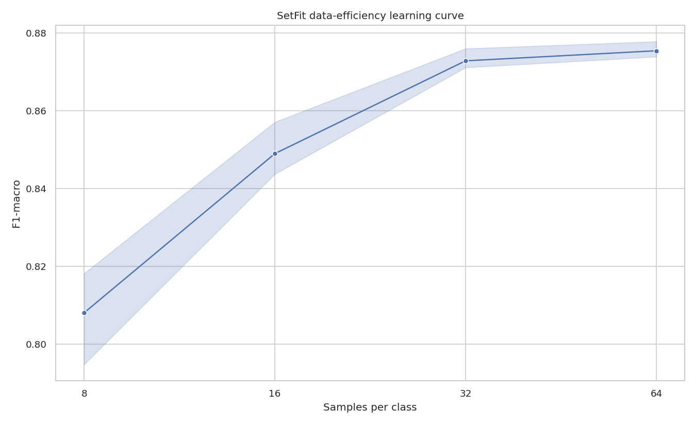
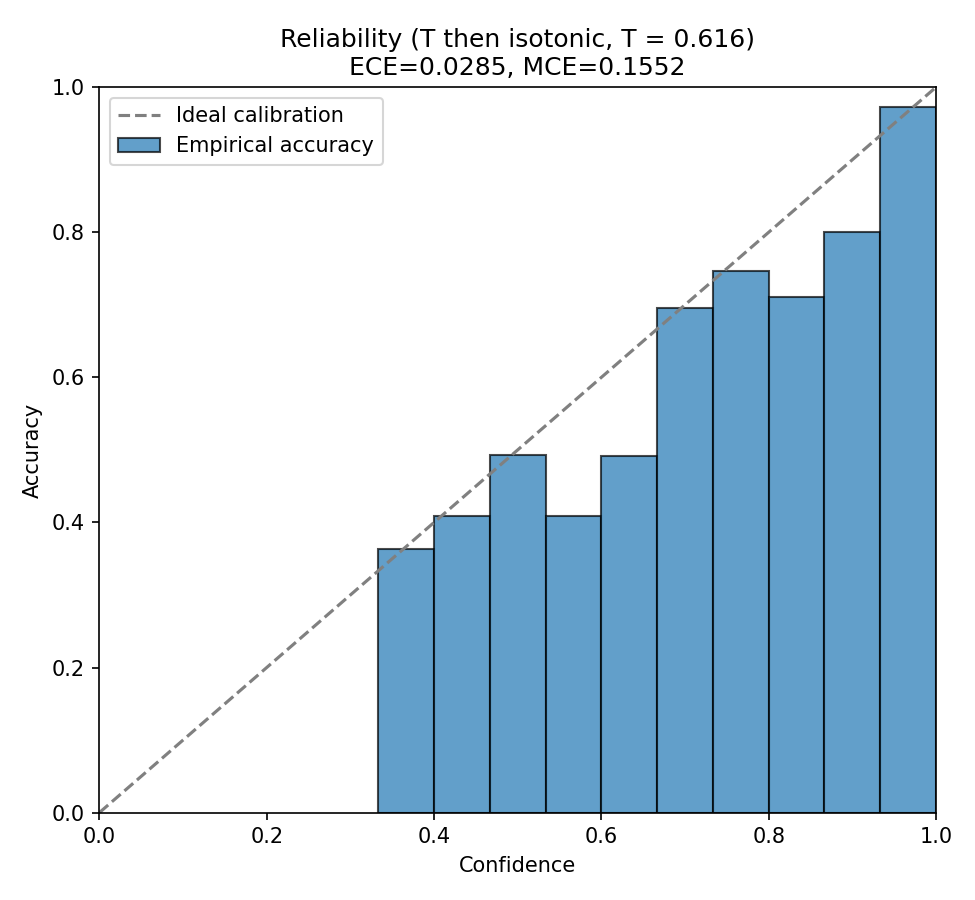
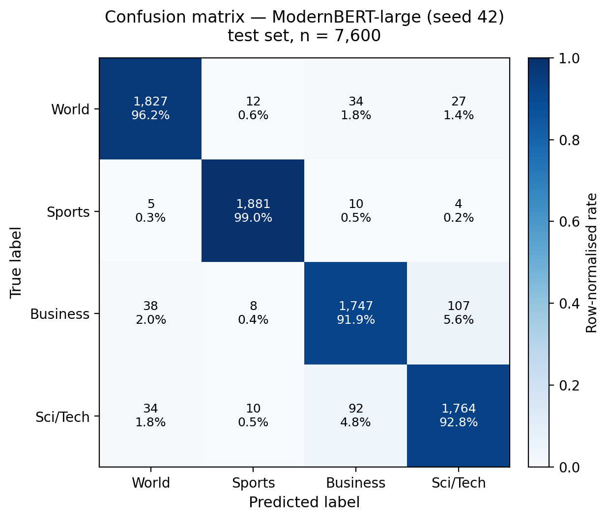
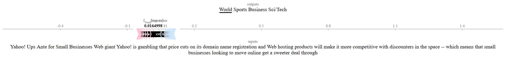
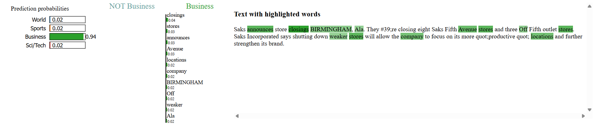
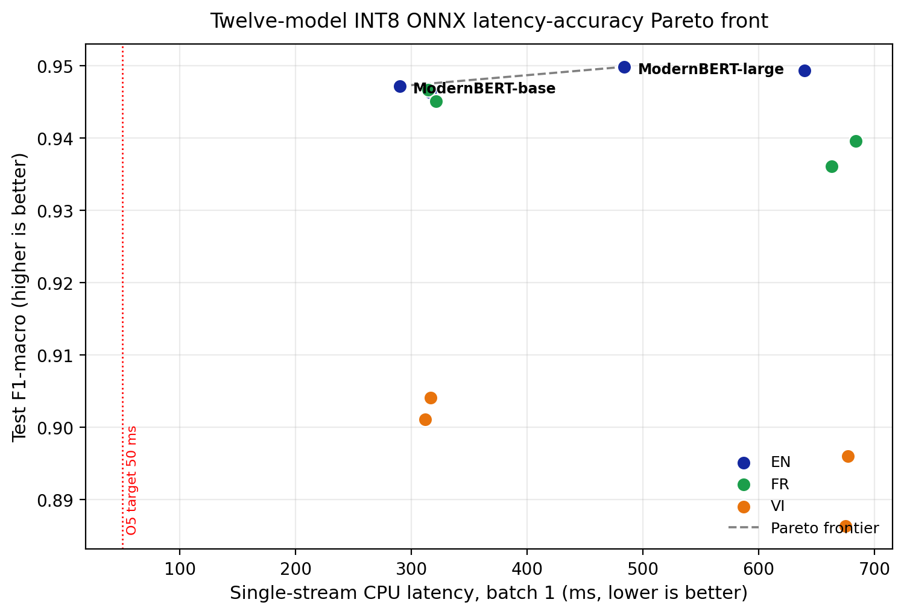

# Full Presentation Deck — AG News Text Classification

> Ready-to-paste content for the SIC PowerPoint template.
> Layout map: **Title slide** → **Table of Contents** → **3 Units × 3 subtitles**.
> Each content slide follows the template's `1.x Subtitle / Slide Title / Level-1 / Level-2` format.
> Target: 12-minute defence + embedded demo video. Team: Aimer PAM — Vo Hai Dung.

---

## SLIDE 1 — Title slide

```
AG News Text Classification
Aimer PAM
Artificial Intelligence Course
```

- Speaker note: "A modern NLP toolkit applied end-to-end to AG News — twelve
  transformers across three languages, from baselines to a calibrated,
  explainable, INT8-deployed classifier."

---

## SLIDE 2 — Table of Contents

```
Unit 1. Problem framing and pipeline
   1.1. Motivation and the 2025 NLP toolkit
   1.2. Objectives O1–O8 and success metrics
   1.3. Dataset, EDA and nine-phase pipeline

Unit 2. Modeling: from baselines to a tri-lingual lineup
   2.1. Classical baselines and transformer scale ablation
   2.2. Variance reduction: R-Drop + 3-seed ensemble
   2.3. Multilingual extension (Vietnamese + French) and few-shot SetFit

Unit 3. Evaluation, deployment and outcomes
   3.1. Calibration and explainability (SHAP / LIME)
   3.2. Latency–accuracy Pareto front and live demo
   3.3. Conclusions, outcomes and future work
```

---

# UNIT 1 — Problem framing and pipeline

## SLIDE 3 — (1.1) Motivation and the 2025 NLP toolkit

**Slide Title:** Why AG News, and why go beyond a single BERT score

- Level-1: The problem
  - Level-2: Topic classification of short news articles into 4 classes —
    World, Sports, Business, Sci/Tech (Zhang, Zhao & LeCun [1]).
  - Level-2: A single fine-tuned BERT already scores ~94 %; the open
    question is everything *around* accuracy.
- Level-1: The gap this project fills
  - Level-2: One repository exercising the full modern stack — robustness,
    calibration, explainability, data efficiency, latency, multilinguality.
  - Level-2: Reproducible, auditable, and deployment-aware, not a notebook.

- Speaker note: Frame AG News as a solved-on-accuracy benchmark; the
  contribution is breadth and engineering discipline, not a new SOTA.

---

## SLIDE 4 — (1.2) Objectives O1–O8 and success metrics

**Slide Title:** Eight objectives, eight measurable targets

- Level-1: Outcome — 6 of 8 objectives met
  - Level-2: O1 English F1 ≥ 0.95 → **0.9528** (met); O3 Vietnamese ≥ 0.90
    → **0.9041** (met); O8 French ≥ 0.90 → **0.9466** (met).
  - Level-2: O4 ECE ≤ 0.03 → **0.0285** (met); O6 public GitHub 200 OK
    (met); O7 SIC report submitted (met).
- Level-1: The two honest misses
  - Level-2: O2/S2 SetFit @64 ≥ 0.93 → 0.8755 (not met).
  - Level-2: O5 latency ≤ 50 ms CPU @batch 1 → 290 ms (not met,
    hardware-bounded — reported transparently).

- Speaker note: Lead with the wins, but name the two misses up front —
  examiners reward honesty about S2 and S5.

---

## SLIDE 5 — (1.3) Dataset, EDA and nine-phase pipeline

**Slide Title:** A clean dataset and a linear, reproducible plan

- Level-1: Dataset and EDA
  - Level-2: 120,000 train / 7,600 test; stratified 90/10 → 108k train /
    12k val; test touched only for final reporting.
  - Level-2: Balanced classes; Cleanlab flags 2,852 (2.6 %) likely
    mislabels, mostly on the Business ↔ Sci/Tech boundary; BERTopic for
    topic structure.
- Level-1: Nine-phase, 76-day pipeline
  - Level-2: Data → baselines → transformers → multilingual → few-shot →
    evaluation → deployment → report; each phase = one runnable
    `scripts/phase{N}.py`.
  - Level-2: Every output under `outputs/`, every input under `configs/` —
    no implicit state.

**Figures:**



*Figure: Four classes, perfectly balanced (30,000 each).*



*Figure: Median 38 words; 99th percentile ≈ 80 → max_len 256.*

- Speaker note: Stress reproducibility — any table in the report regenerates
  from one script per phase.

---

# UNIT 2 — Modeling: from baselines to a tri-lingual lineup

## SLIDE 6 — (2.1) Classical baselines and transformer scale ablation

**Slide Title:** Establishing the reference point, then scaling up

- Level-1: Classical baselines (the sanity check, F1-macro)
  - Level-2: TF-IDF + Linear SVM **92.54 %**, TF-IDF + LogReg 91.64 %,
    FastText 91.70 % (~2.5 min total, CPU).
- Level-1: Transformer scale ablation (English, F1-macro)
  - Level-2: DeBERTa-v3-small 94.63 % (44 M) → ModernBERT-base 94.71 %
    (149 M) → DeBERTa-v3-base 94.93 % (184 M) → ModernBERT-large 94.98 %
    (395 M).
  - Level-2: Strong encoders beat the best classical baseline by 2.44 pp —
    but a single checkpoint still sits 0.02 pp below the 0.95 target.

- Speaker note: Baselines are a reference point, not filler — they quantify
  the real transformer gain and justify the cost.

---

## SLIDE 7 — (2.2) Variance reduction: R-Drop + 3-seed ensemble

**Slide Title:** Closing the last 0.3 pp to meet O1

- Level-1: The method
  - Level-2: 2×3 ablation grid: {vanilla, +R-Drop} × seeds {13, 42, 73}
    on ModernBERT-large.
  - Level-2: R-Drop adds symmetric KL between two stochastic forward
    passes (Liang et al. [9]); checkpoints combined by soft-voting
    (Dietterich [10]).
- Level-1: The result
  - Level-2: **R-Drop 3-seed ensemble = 0.9528 F1-macro** — meets O1 by
    +0.28 pp over target.
  - Level-2: Honesty caveat: N=3 seeds → the F-test / paired t-test for
    variance and mean gains are underpowered (Section 3.3.2.5).

- Speaker note: This is the headline modeling slide. Emphasise the
  variance-reduction story *and* the statistical caveat.

---

## SLIDE 8 — (2.3) Multilingual extension and few-shot SetFit

**Slide Title:** Three languages and a data-efficiency curve

- Level-1: Vietnamese + French (OPUS-MT + back-translation)
  - Level-2: 2×2 grid/language (mDeBERTa-v3 184 M vs XLM-R-large 550 M ×
    back-translation); VI best XLM-R-large + BT **0.9041** (O3); FR best
    XLM-R-large **0.9466** (O8); scale > augmentation in low-resource.
  - Level-2: Corpora are 100 % machine-translated — quality unmeasured
    (BLEU/chrF/COMET scope-out), an honest bound on the result.
- Level-1: Few-shot SetFit (data efficiency)
  - Level-2: K = 8/16/32/64 per class; @64 reaches 0.8755 — recovers
    92.2 % of supervised F1 with 0.24 % of the labels.
  - Level-2: Misses the 0.93 target (S2) but tells a strong
    label-efficiency story.

**Figure:**



*Figure: SetFit recovers 92.2 % of supervised F1 with 0.24 % of the labels.*

- Speaker note: Frame the misses (translation noise, SetFit @64) as
  measured limitations, not failures.

---

# UNIT 3 — Evaluation, deployment and outcomes

## SLIDE 9 — (3.1) Calibration and explainability

**Slide Title:** Trustworthy probabilities and transparent decisions

- Level-1: Calibration (meets O4)
  - Level-2: 4-calibrator grid: baseline / temperature / class-wise
    isotonic / chained T→isotonic.
  - Level-2: Chained T→isotonic drops **ECE 0.0502 → 0.0285** (≤ 0.03);
    SE caveat per Roelofs [36], Vaicenavicius [37].
- Level-1: Explainability + error analysis
  - Level-2: SHAP TextExplainer [18] + LIME [19] run on the deployed
    model and surfaced in the UI — not buried in an appendix.
  - Level-2: Business ↔ Sci/Tech accounts for **52.4 %** of the 380 test
    errors — the dominant, interpretable failure mode.

**Figures:**



*Figure: Chained T→isotonic calibration drops ECE from 0.0502 to 0.0285 (≤ 0.03).*



*Figure: Business ↔ Sci/Tech accounts for 52.4 % of the 380 test errors.*



*Figure: SHAP — finance tokens push a Sci/Tech article toward Business.*



*Figure: LIME on the same article — both methods blame the same tokens.*

- Speaker note: Calibration + explainability is the "trustworthy AI" pillar
  that distinguishes this from a plain accuracy report. SHAP and LIME on the
  *same* misclassified article show both methods blame the finance tokens.

---

## SLIDE 10 — (3.2) Latency–accuracy Pareto front and live demo

**Slide Title:** Twelve models, one Pareto front, one live app

- Level-1: Deployment engineering
  - Level-2: All 12 encoders → ONNX opset 17 → dynamic INT8 via Optimum;
    full 12-row latency–accuracy Pareto front on one host.
  - Level-2: Pareto-optimal single checkpoint: **ModernBERT-base INT8**
    (147 MB, 94.71 % F1, 289.83 ms/sample, single-stream CPU).
- Level-1: Live Gradio demo (embedded video)
  - Level-2: One dropdown over all 12 checkpoints; automatic EN/VI/FR
    routing; sliding-window long-document path; SHAP highlighting.
  - Level-2: O5 latency miss is hardware-bounded (no INT8 model clears
    50 ms @batch 1 on commodity x86) — reported, not hidden.

**Figure:**



*Figure: ModernBERT-base INT8 is Pareto-optimal (147 MB, 289.83 ms, F1 0.9471).*

- Speaker note: Cue the ~36-second demo video here; return to highlight that
  reviewers can reproduce every checkpoint with one local launch.

---

## SLIDE 11 — (3.3) Conclusions, outcomes and future work

**Slide Title:** What was delivered, and what comes next

- Level-1: Conclusions
  - Level-2: Performance — R-Drop ensemble 0.9528 (O1); tri-lingual
    0.9041 VI / 0.9466 FR (O3, O8); calibrated to 0.0285 (O4).
  - Level-2: Breadth — baselines → transformers → multilingual →
    few-shot → calibration → explainability → INT8 deployment, fully
    reproducible.
- Level-1: Future work
  - Level-2: NLLB-200 / shared-encoder multi-task to lift VI & FR;
    instruction-tuned LLM zero-shot baseline (O2); static-calibration INT8
    (O5); continuous-evaluation CI dashboard.

- Speaker note: Close on the 6/8 scorecard and the three concrete
  next steps tied to the two misses.

---

## SLIDE 12 — Q&A / Selected references

**Header (top bar):** Q&A / Selected references

**Slide Title (large, centred):** Thank you — Questions?

```
Aimer PAM · Vo Hai Dung
github.com/VoHaiDung/ag-news-text-classification
```

**Selected References** — small "fine print" block, ~11 pt, lower half of
the slide, laid out in **two columns** (numbering matches the final
report, Section 7):

```
Column 1                                     Column 2
[1]  Zhang, Zhao & LeCun (2015) — AG News    [19] Ribeiro et al. (2016) — LIME
[6]  Warner et al. (2024) — ModernBERT       [22] Guo et al. (2017) — Temperature scaling
[9]  Liang et al. (2021) — R-Drop            [23] Zadrozny & Elkan (2002) — Isotonic regression
[10] Dietterich (2000) — Ensemble methods    [36] Roelofs et al. (2022) — Calibration-error bias
[12] Tunstall et al. (2022) — SetFit         [37] Vaicenavicius et al. (2019) — Evaluating calibration
[14] Tiedemann & Thottingal (2020) — OPUS-MT
[18] Lundberg & Lee (2017) — SHAP
```

- Speaker note: Leave this slide up during Q&A. The reference block is
  there to answer "where does that number come from?" without switching
  slides. Backup material (full 12-model latency table, hyper-parameter
  grid, all four reliability diagrams, confusion matrix, risk register,
  Cleanlab audit detail) is kept in hidden slides after the closing page.

---

## SLIDE 13 — Closing slide (Samsung Innovation Campus template)

> Use the official SIC closing slide as-is — do not retype. It is the last
> page of the provided `.pptx` template (full-bleed blue background, centred
> white wordmark). Nothing on this slide is project-specific.

```
                         Together for Tomorrow!
                          Enabling People
                     Education for Future Generations


© 2025 SAMSUNG. All rights reserved.
Samsung Electronics Corporate Citizenship Office holds the copyright of book.
This book is a literary property protected by copyright law so reprint and
reproduction without permission are prohibited.
To use this book other than the curriculum of Samsung Innovation Campus or to
use the entire or part of this book, you must receive written consent from
copyright holder.
```

- Speaker note: This is the standard SIC sign-off page. Leave the slide
  exactly as shipped in the template; end the talk on "Together for
  Tomorrow — Enabling People."
